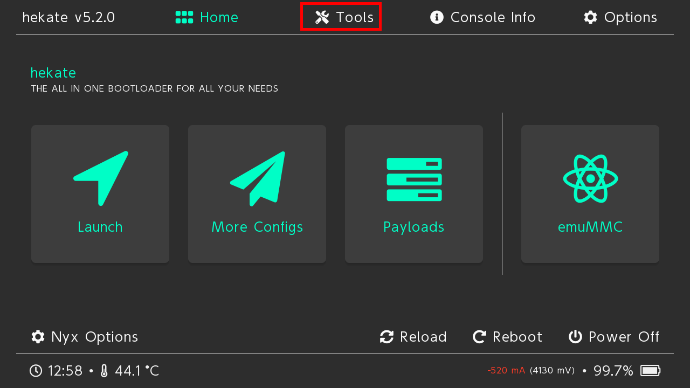
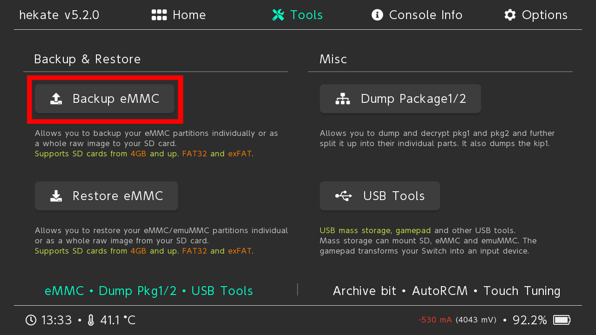
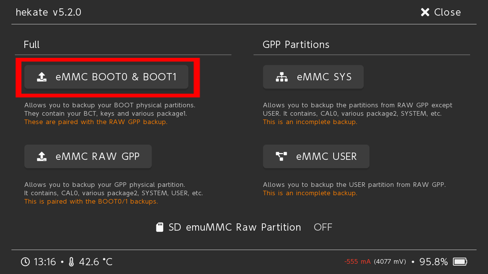
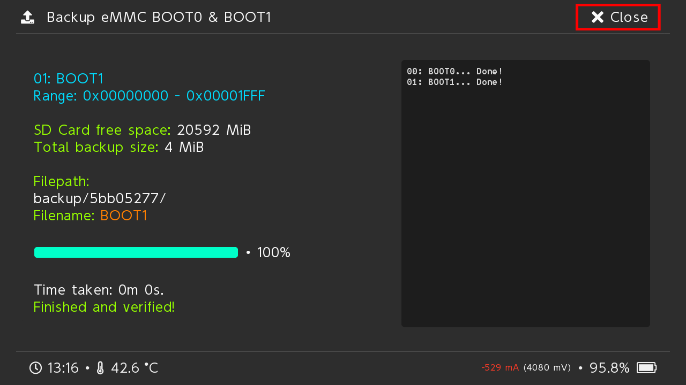
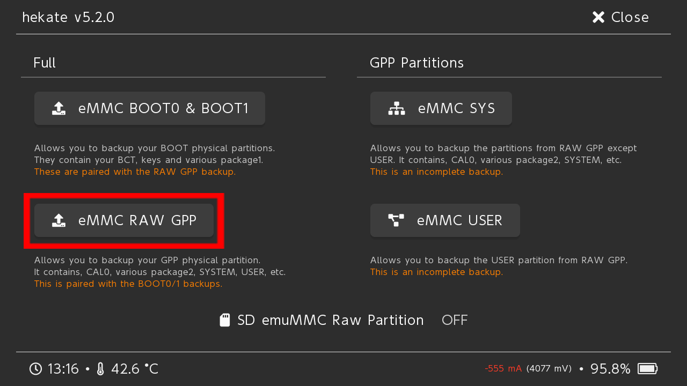
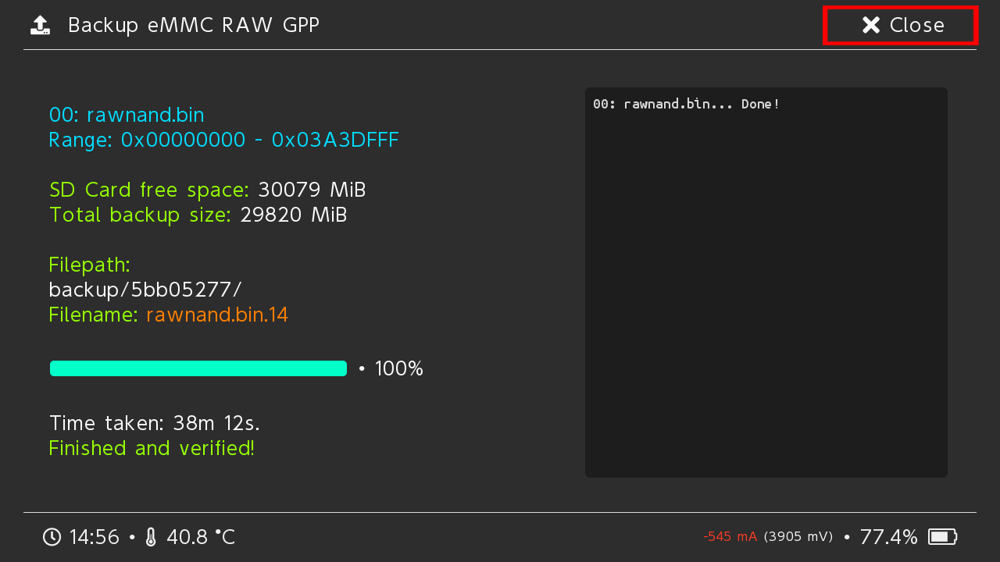
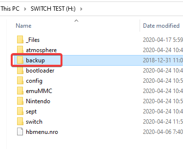

# atmosphere-switch
大气层switch破解方案

# 准备
* 可以软破的switch
* RCM注入器v5，某宝上有售
* sd卡，格式化为fat32

# 准备SD卡
* 下载[大气层](https://github.com/Atmosphere-NX/Atmosphere)最新版
* 把atmosphere-xxxxxx-master-xxxxxxxx+hbl-xxx+hbmenu-xxx.zip解压到sd卡
* 下载[hekate](https://github.com/CTCaer/hekate)最新版
* 把 hekate_ctcaer_xxxx_Nyx_xxx.zip解压到sd卡
* 留意这里的hekate_ctcaer_xxx.bin，下面会用到
* 把RCM注入器插入电脑，会识别为U盘
* 打开\ATMOSPHERE_HEKATE，把刚才的hekate_ctcaer_xxx.bin复制为payload.bin，然后拔掉
* 打开网站[sdsetup](https://www.sdsetup.com/)
* 选择Minimal，然后下载
* 解压SDSetup(xxxx).zip，将sd/bootloader拷贝到switch的sd卡，覆盖bootloader目录
* 下载[patches](https://github.com/ITotalJustice/patches)最新版
* 把hekate.zip解压到switch的sd卡
* 下载[tinfoil](https://tinfoil.io/)的最新NRO版本
* 解压tinfoil.latest.zip到switch的sd卡
* 下载[nxmtp](https://github.com/liuervehc/nxmtp)的最新NRO版本
* 解压到switch的sd卡
* （可选）顺便拷贝游戏

# 启动
* 按住开关10秒，把switch强行关机
* 插入短接器，同时按音量+、电源键，然后放开
* 长按RCM注入器的加号，直到闪烁蓝灯，说明是大气层模式。不是则放开，再长按切换
* RCM注入器插入到switch
* switch启动到boot界面

# 备份系统
* 点击tools

* 点击backup emmc

* 点击第一个

* 结束关闭

* 点击第二个

* 结束关闭

* 最终的backup目录，可以拷贝到其他地方保存

# 虚拟系统
https://switch.homebrew.guide/emummc/emummc.html

# 安装游戏
* 卸载系统中已有的tinfoil
* 打开相册，进入自定义app界面，点击tinfoil，等几秒钟闪下屏幕
* 回到桌面，进入tinfoil。第一次可能会联网更新，等待更新结束重启tinfoil
* 下载[tinfoil nut](https://github.com/blawar/nut/releases)的nut.exe、tinfoil_driver.exe，安装tinfoil_driver.exe，打开nut.exe
* 将usb线连上switch，在tinfoil会看到usbfs里有电脑的盘符，找到对应的nsp或者xci安装

