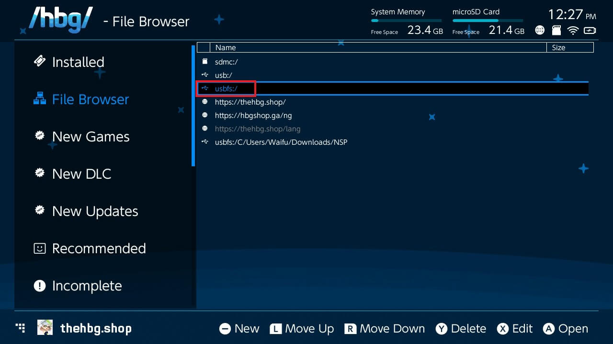

# atmosphere-switch
大气层switch破解方案

# 准备
* 可以软破的switch
* RCM注入器v5，某宝上有售
* sd卡，格式化为fat32

# 准备SD卡
* 下载[大气层](https://github.com/Atmosphere-NX/Atmosphere)最新版
* 把atmosphere-xxxxxx-master-xxxxxxxx+hbl-xxx+hbmenu-xxx.zip解压到sd卡
* 下载fusee.bin，下面会用到
* 下载[hekate](https://github.com/CTCaer/hekate)最新版
* 把 hekate_ctcaer_xxxx_Nyx_xxx.zip解压到sd卡
* 留意这里的hekate_ctcaer_xxx.bin，下面会用到
* 把RCM注入器插入电脑，会识别为U盘
* 打开\ATMOSPHERE_HEKATE，把刚才的hekate_ctcaer_xxx.bin复制为payload.bin，然后拔掉
* 把刚才的fusee.bin拷贝到switch的sd卡，放到bootloader\payloads目录
* 打开网站[sdsetup](https://www.sdsetup.com/)
* 选择Minimal，然后下载
* 解压SDSetup(xxxx).zip，将sd/bootloader/hekate_ipl.ini拷贝到switch的sd卡，覆盖bootloader/hekate_ipl.ini文件
* 下载[patches](https://gbatemp.net/threads/sigpatches-for-atmosphere-hekate-fss0-fusee-package3.571543/)最新版
* 把sigpatches.zip解压到switch的sd卡
* （可选）下载安装工具[tinfoil](https://tinfoil.io/)的最新NRO版本
* 解压tinfoil.latest.zip到switch的sd卡
* （可选）下载安装工具[DBI](https://github.com/rashevskyv/dbi)的dbi.nro、dbi.config
* 放入switch/DBI/目录
* （可选）下载安装工具[Awoo-Installer](https://github.com/Huntereb/Awoo-Installer)，下载解压到sd卡
* （可选）下载存档修改工具[EdiZon](https://github.com/WerWolv/EdiZon)的Edizon.nro，放入switch目录下

# 启动
* 按住开关10秒，把switch强行关机
* 插入短接器，同时按音量+、电源键，然后放开
* 长按RCM注入器的加号，直到闪烁蓝灯，说明是大气层模式。不是则放开，再长按切换
* RCM注入器插入到switch
* switch启动到boot界面

# 备份系统
* 点击tools


* 点击backup emmc


* 点击第一个


* 结束关闭


* 点击第二个


* 结束关闭


* 最终的backup目录，可以拷贝到其他地方保存


# 虚拟系统
https://switch.homebrew.guide/emummc/emummc.html

# 安装游戏
* 卸载系统中已有的tinfoil
* 打开相册，进入自定义app界面，点击tinfoil，等几秒钟闪下屏幕
* 回到桌面，进入tinfoil。第一次可能会联网更新，等待更新结束重启tinfoil
* 如果提示打开失败，则重启switch，选择fusee引导，再重试安装tinfoil
* 下载[tinfoil nut](https://github.com/blawar/nut/releases)的nut.exe、tinfoil_driver.exe，安装tinfoil_driver.exe，打开nut.exe
* 将usb线连上switch，在tinfoil会看到usbfs里有电脑的盘符，找到对应的nsp或者xci安装
* 如果打开看不到，pc的命令行窗口输出```usb exception: [Errno None] b'libusb0-dll:err [_usb_reap_async] reaping request failed, win error```，重启switch解决。还是不行，则删除tinfoil，然后重启switch，再安装tinfoil。
* 如果还是看不到，从https://zadig.akeo.ie/ 下载zadig.exe，插入switch，打开exe，勾选"List All Devices"。选择tinfoil，选择libusbK，点击"Replace Driver"。然后重启nut.exe。



* 如果还是不行，那就安装[Awoo-Installer](https://github.com/Huntereb/Awoo-Installer)，下载解压到sd卡
* 按住R，打开任意一个游戏，出现app界面，选择Awoo
* 进入后，选择usb安装
* 在电脑上下载[ns-usbloader](https://github.com/developersu/ns-usbloader)，拖入游戏，点击上传
* Awoo里选择游戏，安装即可

